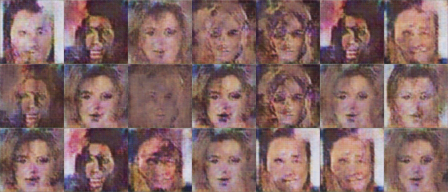
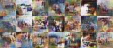
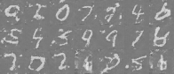
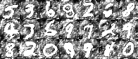

# Summary: 2022/7/21
***
## 整理各个模型在各个数据集上的FID结果如下：
* "()"代表原始结果在12服务器上，仅凭记忆写出，可能不准确
* "~"代表目前未做实验

|方法\数据集|MNSIT|FashionMNIST|CIFAR-10|CelebA|
|----------|-----|-------------|--------|------|
|baseline|99.67|175.34|178.40|238.42|
|baseline+attention|69.64|**165.42**||**151.36**|
|baseline+attention+infoNCE|**66.85**|196.85|~|~|

***

## 根据上周五对weighted decoding的改进思路，MNSIT上整理结果如下：
* origin 代表输出时先sigmoid再softmax
* origin+remove_softmax 代表输出时仅sigmoid，去掉softmax
* origin+remove_sigmoid 代表输出时去掉sigmoid，仅softmax

|方法|FID|
|----|----|
|origin|**120.66**|
|origin+remove_softmax|365.47|
|origin+remove_sigmoid|265.62|

***

## 部分新结果展示
 

    
     
    <b>CelebA</b>
     
     
     
    
     
    <b>CIFAR-10</b>
     
     
     
    
     
    <b>remove sigmoid</b>
     
     
     
    
     
    <b>remove softmax</b>

